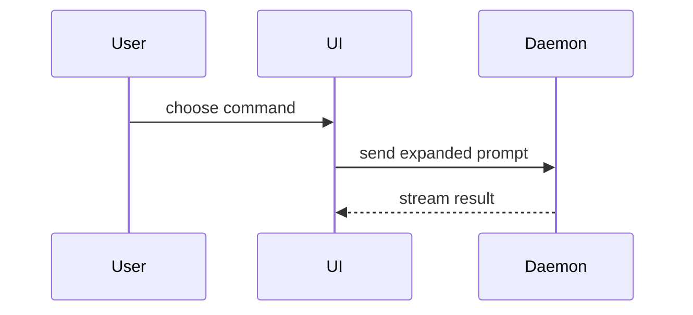

# Visualize

Help the user understand the current topic with the smallest truthful visual. Route first, then author. Skip the preamble and keep prose brief.

## Routing

Choose one representation:

- **Markdown table** for ordinary rows and columns. Return it directly.
- **Inline code-shape sketch** (pseudocode, call tree, component tree, file tree, diff) for logic, flow, structure, and changes. Return it directly.
- **Fenced Mermaid** for static labeled relationships: sequence diagrams, ERDs, schemas, class diagrams. Return it directly.
- **HTML explainer file** when the concept is too dense for the above: multi-section walkthroughs, charts, spatial layouts, state comparisons, infographics, slide decks, or anything needing zoom/pan and collapsibles.
- A request for a standalone app, site, page, or component is **not** a visualization. Build it in the project (see `web-app-builder` for interactive single-file apps).

If an explanation depends on sequence, containment, or mechanism, treat it as a diagram. Place each visual next to the short text it supports. You may use one form or several; you will rarely use all. Don't overwhelm the user.

## Rules for every route

- Work silently. Don't announce the skill, the chosen format, or implementation details — return the answer.
- Put the primary question and its answer first, with a clear hierarchy. Choose the smallest composition that completes the job.
- Do not invent data, content, metrics, or states. Use source values and labels exactly unless the user requests a transformation. Do not present an estimate as an observation. Label derived values when the method isn't obvious; label every assumption in a requested simulation.
- Use position, length, area, and color only when each encoding has meaning. Pair color with text, shape, or position.
- Do not repeat the prompt, restate visible information, or draw the same data in a second form.

## Inline forms

- Logic or an algorithm as pseudocode:

```text
on(save)
  if content is unchanged
    return cached result
  write new content
  return fresh result
```

- Runtime control flow as a call tree:

```text
submitForm
  createSession
    persistPrompt
    launchAgent
  navigateToSession
```

- UI structure as a component tree, including state and module boundaries that matter:

```tsx
<SessionPage> (apps/example/src/routes/session.tsx)
  useSessionEvents()
  <SessionToolbar>
    <RunSkillButton> (packages/ui)
```

- File responsibility or a broad refactor as a shallow file tree:

```text
src/
├── commands/       # parses user actions
├── sessions/       # owns session state
└── transport/      # sends API requests
```

- Component interaction, control flow, or data flow as Mermaid:



- Use `diff` when the point is what changes and the surrounding shape already exists. Match the diff shape to the topic — it works on component trees, file layouts, call trees, and control flow alike:

For a component change:

```diff
 <SessionPage>
   useSessionEvents()
   <SessionToolbar>
+    <RunSkillButton />
   <SessionTimeline>
+    <SkillResultCard />
```

For a file-layout change:

```diff
 src/
 ├── commands/
+│   └── show-me.ts       # expands the slash command
 ├── sessions/
-└── transport.ts
+└── transport/
+    ├── client.ts
+    └── stream.ts
```

For a call-tree or call-stack change:

```diff
 submitForm
   createSession
     persistPrompt
+    expandSkillMention
     launchAgent
-  navigateToSession
+  navigateToSession
+    subscribeToEvents
```

For a state or control-flow change:

```diff
 on(save)
-  write content
+  if content is unchanged
+    return cached result
+  write new content
+  invalidate cache
```

- Show the whole block when most of it is new, when omitted context would hide ownership or order, or when the user needs a copyable target shape:

```ts
function expandSkill(command: string): string {
  const skillName = command.slice(1);
  return `use the ${skillName} skill`;
}
```

## HTML explainers

Produce a self-contained HTML page that makes one thing genuinely understood. You own the structure: pick the sections, diagram language, and depth that fit the content. Open the finished file for the user (`open path/to/visualize-{description}.html`).

**Boundary**: static explanatory documents (interactivity limited to zoom/pan, collapsibles, quiz reveals, slide nav). This skill does not build interactive apps.

### Interactive vs pipeline use

**Interactive session (a person asked for an explainer): interview, then build iteratively. Do not one-shot.**

1. **Interview first.** Ask 2–3 questions with `AskUserQuestion` before writing anything: who reads this and what do they already know; what specifically is confusing or what decision the page must support; overview or deep walkthrough. Skip only what the conversation already answered.
2. **Skeleton before flesh.** Deliver a thin version first — title, section outline, one representative diagram, the core example you intend to trace through. Ask what's missing or wrong.
3. **Build out on feedback.** Deepen the sections that matter to the reader; cut the ones that don't. Repeat until the reader says it lands.

**Pipeline artifact (subagent output, journey runbook, unattended generation): one-shot is correct.** Apply the same quality bar; skip the interview.

### Quality bar

These three properties are what make an explainer worth reading. Check each before delivery.

1. **Real walkthroughs with concrete examples.** Trace actual-looking data through the system end to end — a named campaign, a real-shaped SQL row, a specific request payload — not labeled boxes and abstract nouns. Pick one or two worked examples early and reuse them across every section so the reader follows a single thread. Diagrams show the example values flowing, not just component names.
2. **Well-labeled diagrams that map structure cleanly.** Data flows, hierarchies, and interface boundaries each get a diagram whose every node, edge, and boundary is labeled with what it _is_ and what _crosses_ it. If a diagram needs a paragraph to be understood, redraw the diagram. Split anything with 15+ elements into an overview plus detail views.
3. **Narrative a five-year-old could follow.** Simple, connected writing: each section states plainly what the reader now knows and why the next section follows. Apply the `ste-prose` skill to the prose — one meaning per word, active voice, short sentences. Define every term at first use or link it to a definition. No section may depend on knowledge the page hasn't built yet.

A quiz (4–6 medium-difficulty multiple-choice questions with click-to-reveal answers) is a good closer for teaching-oriented pages — answerable only if the reader understood the substance, no gotchas.

### Design language

Keep one consistent visual identity across explainers so a reader moving between pages never re-learns the vocabulary:

- **Cool-slate, light by default**: grey `#f6f7f9` page, white surfaces, navy `#10192b` text, teal-led jewel-tone accents (amber/blue/red/green for states). Dark or adaptive theming only on request.
- Depth via borders, surface contrast, and spacing — plain backgrounds, restrained shadows, no texture or gradient atmosphere.
- One display typeface for headings with strong size contrast, one mono face for code and meta lines, always with fallbacks.
- Exact tokens live in `./references/css-patterns.md` (Theme Setup); the diagram shell template already applies them.

Within that identity, vary layout and composition freely to serve the content. Match information density to the width: check the page at normal desktop width and on mobile; stack before content overlaps or clips.

### Building blocks

- **Single self-contained file.** Inline CSS/JS; CDN links only for libraries (Mermaid, Chart.js, Google Fonts — always with font fallbacks).
- **Semantic HTML** for tables, headings, lists, `<details>`, and captions, each control with a visible label or accessible name. Long pages get a table of contents; make a skippable `<details>` primer for background the expert reader already has.
- **Mermaid diagram shell.** Never emit a bare `<pre class="mermaid">`. Start complex diagrams from `./templates/mermaid-flowchart.html` — it wires zoom, pan, fit, 1:1, and expand controls. Use `theme: 'base'` with page-matched variables; quoted labels with `<br/>` (never `\n`); never define a page-level `.node` CSS class (Mermaid uses it).
- Consult the rest only when stuck on a specific mechanism, not as required reading: `./references/css-patterns.md` (overflow guards, tables, connectors, bespoke diagrams, slide density limits), `./references/libraries.md` (Mermaid theming and syntax gotchas, Chart.js, fonts), `./references/responsive-nav.md` (sticky table of contents with scroll-spy), `./templates/slide-deck.html` (the slide engine, for slides on request).
- **Hand-built HTML/inline-SVG diagrams** when the point is visual weight, layering, or mass rather than graph structure — Mermaid can't do editorial emphasis.
- **Slides on request only**: one `100dvh` viewport per slide, visible prev/next + keyboard nav, and no dropped content to hit a slide count.

### Hard-won gotchas

- Code blocks: `white-space: pre-wrap; overflow-wrap: break-word;` or long lines silently overflow.
- Global overflow guard: `overflow-x: hidden` on body plus `min-width: 0` on grid/flex children; check at normal desktop width before delivery.
- Never `display: flex` on `<li>` — it destroys list markers. Custom-numbered lists need explicit counters.
- Wrap animations in `@media (prefers-reduced-motion: no-preference)`; keep motion user-triggered and finite; animate only to clarify state or hierarchy.

## Review and return

- Did you choose the smallest format, and does the result answer the main question first?
- Do values, labels, units, and order match the source?
- For HTML: does the file open with no console errors, is the main idea visible in the first viewport, is the first paint useful without input, and does the layout hold on mobile widths?

Stop after you return the visual or open the HTML file. Do not start servers or follow unrelated skills.
